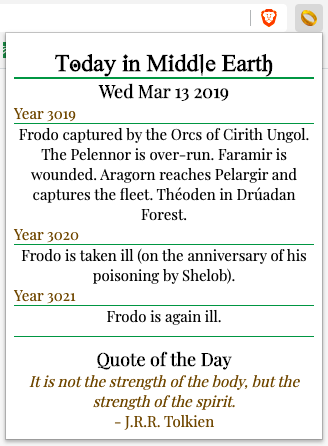
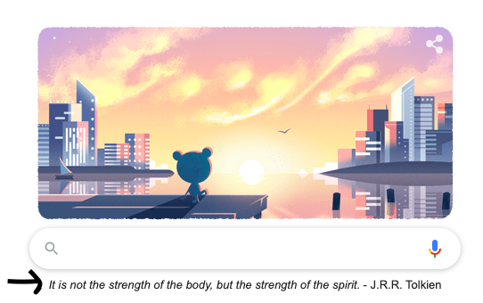
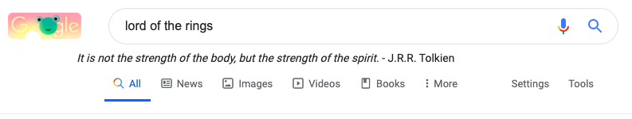
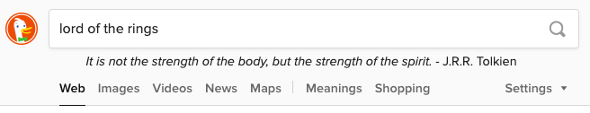
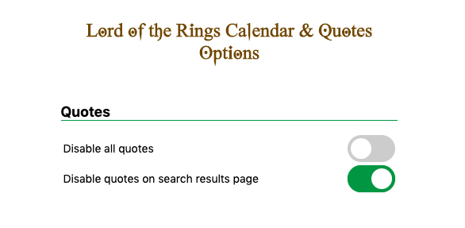

# Lord of the Rings Quotes and Calendar Chrome Extension

What happened today in Middle Earth? Find out with an accompanied quote of the day from the Lord of the Rings trilogy by J.R.R. Tolkien.  

## What Happened Today in Middle Earth?

By clicking on the extension icon, you can see all events that happened today
in Middle Earth, according to the appendices.

## Quote of the Day

Receive a quote of the day to accompany your daily online searches (support
for search engines Google and DuckDuckGo).

Google | DuckDuckGo
--- | ---
 | 
 | 

## Options

Decide where or if you want to see the quote of the day through the intuitive
options menu accessible by viewing the details of the extension in your
browser.

